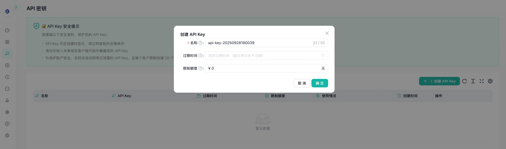

## Overview

`智匣·融智` (LLM Slate)为开发者、创业者和企业提供了一套开箱即用的、从后端到前端的完整解决方案，旨在将您从复杂的底层工程中解放出来，让您 100% 专注于核心业务与产品创新。

## Configure

Install the LLMSlate plugin, then configure it by entering your API Key. Get your API Key from [LLMSlate](https://dashboard.llmslate.com/api-keys) and save.

## **`智匣·融智` 为您解决了什么？**

我们预置并整合了 AI 应用商业化中最关键的四大基础设施：

- **统一模型中枢 (Unified Model Hub)**：告别繁杂的 API 文档，通过单一接口，轻松驾驭全球顶尖大模型。
- **动态计费引擎 (Dynamic Billing Engine)**：内置灵活的计费与订阅模型，让您的商业模式拥有无限可能。
- **聚合支付网关 (Aggregated Payment Gateway)**：主流支付渠道开箱即用，上线即收费，加速现金回流。
- **企业级管理后台 (Enterprise-Grade Admin Panel)**：用户、订单、权限、内容管理，一站式搞定，运营无忧。

[LLMSlate Website](https://www.llmslate.com/) | [LLMSlate Dashboard](https://dashboard.llmslate.com/)
