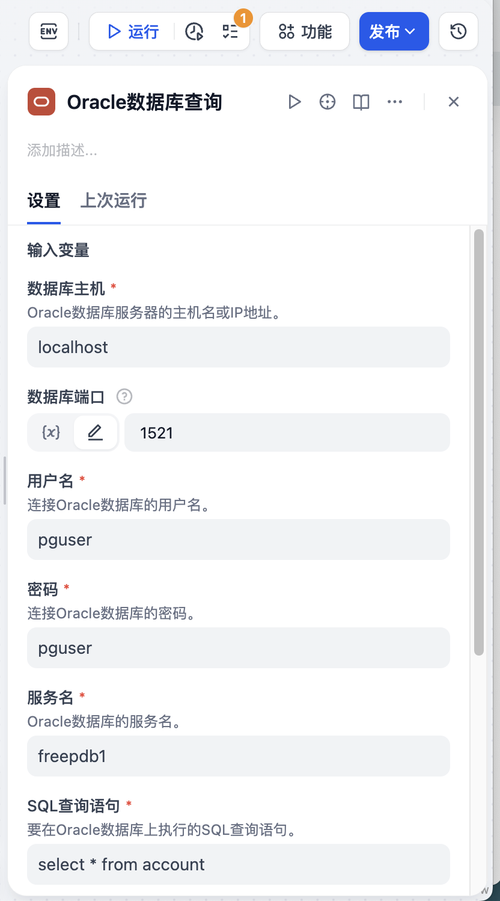
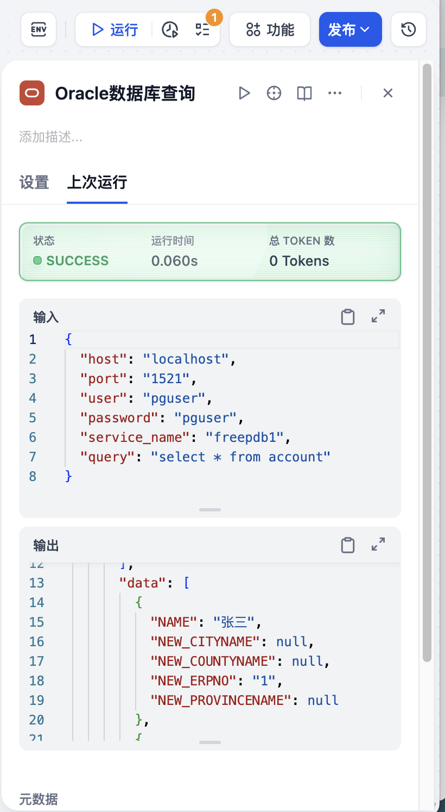

## Oracle Database Query Plugin

**Author:** FindOracle
**Version:** 0.0.1
**Type:** tool
**Repo:** [https://github.com/WilburOracle/dify-oracle-db-plugin](https://github.com/WilburOracle/dify-oracle-db-plugin)
**中文版介绍:** 见末尾

### Description

This plugin allows you to connect to Oracle databases (Oracle Database 23ai) and execute SQL queries. It provides a simple interface to query Oracle databases directly from Dify.

### Features

- Connect to Oracle databases using Thin Mode (no need for Oracle client installation)
- Execute SQL queries and retrieve results in a structured format
- Support for common Oracle data types
- Error handling and detailed error messages
- Oracle is a converged database, this plugin can execute multi-modal SQL, including relational data queries, property graph data queries, JSON document data queries, vector data queries, etc.

### Parameters

When using this plugin, you need to provide the following parameters:

| Parameter | Type | Required | Description |
|-----------|------|----------|-------------|
| host | String | Yes | The hostname or IP address of the Oracle database server |
| port | Integer | Yes | The port number of the Oracle database server (default is 1521) |
| user | String | Yes | The username for connecting to the Oracle database |
| password | String | Yes | The password for connecting to the Oracle database |
| service_name | String | Yes | The service name of the Oracle database |
| query | String | Yes | The SQL query to execute against the Oracle database |

### Example Usage

```sql
-- Example query to get data from a table
SELECT * FROM employees WHERE department = 'IT' LIMIT 10;
```

### Return Format

The plugin returns results in JSON format with the following structure:

```json
{
  "status": "success",
  "data": [
    {"column1": "value1", "column2": "value2"}, 
    {"column1": "value3", "column2": "value4"}
  ],
  "columns": ["column1", "column2"],
  "message": "Query executed successfully, returned 2 rows."
}
```

In case of an error, the response will be:

```json
{
  "status": "error",
  "message": "Error description"
}
```

### Privacy Note

This plugin only executes SQL and returns results to Dify workflows. It does not actively or passively collect user information.

---

## Oracle 数据库查询插件
### 描述

此插件允许您连接到 Oracle 数据库并执行 SQL 查询。它提供了一个简单的界面，可直接从 Dify 查询 Oracle 数据库。

### 功能特性

- 使用 Thin 模式连接到 Oracle 数据库（无需安装 Oracle 客户端）
- 执行 SQL 查询并以结构化格式检索结果
- 支持常见的 Oracle 数据类型
- 错误处理和详细的错误信息
- Oracle 是一个融合数据库，本插件可以执行多模态的 SQL，比如关系型数据查询，属性图数据查询，JSON文档数据查询，向量数据查询等

### 参数说明

使用此插件时，您需要提供以下参数：

| 参数名 | 类型 | 是否必需 | 描述 |
|---------|------|----------|------|
| host | 字符串 | 是 | Oracle 数据库服务器的主机名或 IP 地址 |
| port | 整数 | 是 | Oracle 数据库服务器的端口号（默认是 1521） |
| user | 字符串 | 是 | 连接到 Oracle 数据库的用户名 |
| password | 字符串 | 是 | 连接到 Oracle 数据库的密码 |
| service_name | 字符串 | 是 | Oracle 数据库的服务名称 |
| query | 字符串 | 是 | 要在 Oracle 数据库上执行的 SQL 查询 |

### 使用示例

```sql
-- 从表中获取数据的示例查询
SELECT * FROM employees WHERE department = 'IT' LIMIT 10;
```

### 返回格式

插件以 JSON 格式返回结果，结构如下：

```json
{
  "status": "success",
  "data": [
    {"column1": "value1", "column2": "value2"}, 
    {"column1": "value3", "column2": "value4"}
  ],
  "columns": ["column1", "column2"],
  "message": "查询执行成功，返回 2 行数据。"
}
```

如果发生错误，响应将是：

```json
{
  "status": "error",
  "message": "错误描述"
}
```

### 隐私说明

本插件只执行 SQL 并将结果返回 Dify工作流，不会主动/被动收集用户信息。

### 使用示例

#### 参数配置



#### 执行结果


